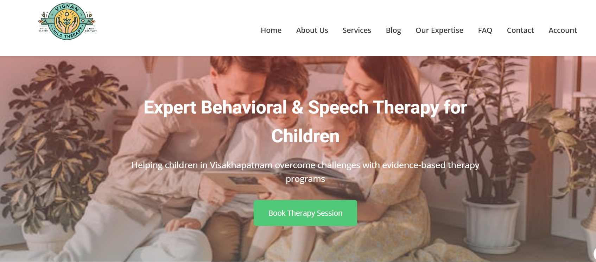
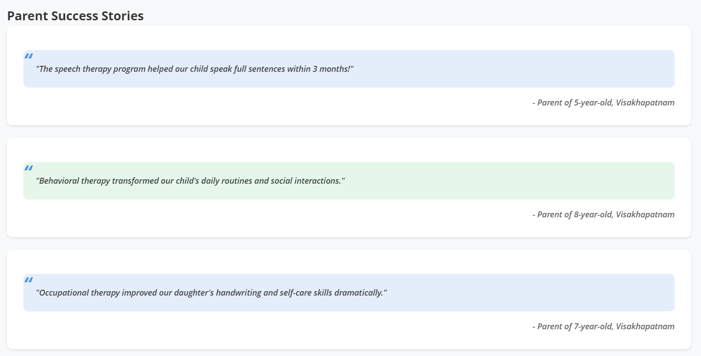
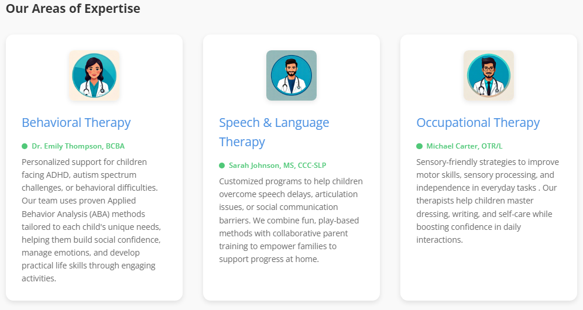
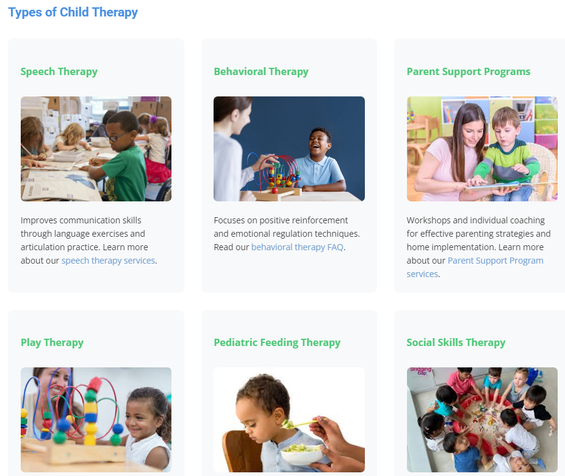
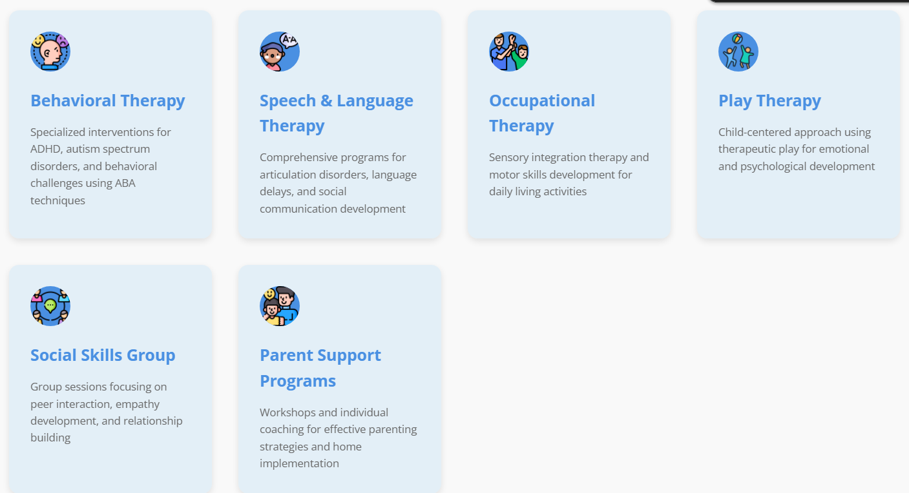

# 🌟 Vignan Child Therapy Centre  
**A 24-hour Hackathon project for an SEO-optimized child therapy website*
**Preview - https://childtherapy.netlify.app

  

## Table of Contents  
- Overview  
- Features  
- Tech Stack
- Installation
- Usage  
- Screenshots  
- Contributing  
- License  
- Acknowledgments  

---

## 📖 Overview  
A responsive website designed to provide accessible child therapy services in Visakhapatnam, specializing in:  
- **Behavioral Therapy**  
- **Speech Therapy**  
- Parent-child interaction programs  
- Early intervention support  

**SEO Focus**: Optimized for keywords like "Behavioral therapy", "Speech therapy", and "Child development".

---

## 🚀 Features  
1. **SEO-Optimized Content**  
   - Keyword-rich meta descriptions and headers  
   - Schema markup for local business visibility  

2. **Responsive Design**  
   - Mobile-friendly navigation with hamburger menu  
   - Adaptive grids for different screen sizes  

3. **Therapy Services**  
   - Detailed service pages with therapist profiles  
   - Appointment booking system (`book.html` + PHP backend)  

4. **Accessibility**  
   - Alt text for all images  
   - ARIA labels for screen readers  

5. **Interactive Elements**  
   - Gradient animations on service cards  
   - Swiper.js testimonials carousel  

---

## 💻 Tech Stack  
| Technology      | Usage                                |
|-----------------|--------------------------------------|
| HTML5/CSS3      | Core structure & styling             |
| JavaScript      | Interactive components               |
| PHP             | Appointment form handling            |
| XAMPP           | Local server testing                 |
| Swiper.js       | Testimonial slider                   |
| Font Awesome    | Icons for service cards              |

---

## 🛠️ Installation  
1. Clone the repository: 
       git clone https://github.com/yourusername/child-therapy-centre.git  
2. Set up XAMPP server
3. Place files in htdocs folder
4. Start Apache/MySQL modules
5. Configure PHP contact form:
   // Update in submit.php  
       $to = "your@email.com";
6. Run locally:
       http://localhost/children-therapy-centre

---

##📱 Usage
Homepage:
  - View featured therapies
  - Book appointments via sticky CTA button
Service Pages:
  - Explore detailed therapy descriptions
  - View therapist qualifications
Blog:
  - Access child development resources
  - Read success stories
    
---

##📸 Screenshots
  
  

  

---

##🤝 Contributing
1. Fork the repository-
2. Create a feature branch:
      git checkout -b feature/new-feature  
3. Add your changes with SEO improvements or UI enhancements
4. Submit a pull request

Guidelines:
  - Maintain keyword density (2-3%)
  - Ensure mobile responsiveness
  - Validate schema markup changes

---

##📄 License
This project is licensed under the Apache License 2.0 - see LICENSE.md for details.
